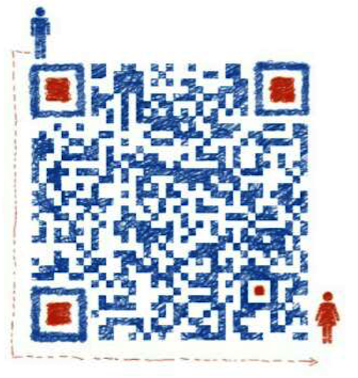

## 业务介绍

Hi,你好。恭喜你有机会能接触我们的这个服务平台。我们主要是做淘宝天猫内部优惠券的。我们不卖产品，只帮大家推荐有优惠券的商品。如果您能坚持好好的利用我们的平台，那我们就能帮助您每年购物省去一大笔钱。

如果您在天猫或淘宝上看中了某一个商品，您可以把商品链接发送到我们的群里，我们可以帮助您查询该商品是否有内部优惠券，然后您就可以以更便宜的价格得到这个商品。

如果您这阶段想买某一类型的商品，您可以利用我们的系统把这类信息提交给我们，然后我们在后台选好之后再放到这个平台上供您选择。

在您淘宝购物之前，我们强烈推荐您先访问我们的优惠券汇集平台 [我溜溜购物网](http://w66g.com) 里面搜集的都是天猫淘宝有内部优惠券的商品，质量也是非常不错的。

## 概念介绍

### 什么是优惠券？

什么是优惠券？所谓的优惠券就是淘宝或天猫商家做促销的一种手段，比如商家的天猫店铺里一个暖手宝，原价是50元。现在他要做促销刷销量，于是他就为自己的店铺设置了1000个优惠券，每个优惠券是20元，促销时间是两天。那么，如果你在他做活动期间领取了这个商品的优惠券，当你付款的时候会原价自动减去20元，你只需要付款30元就能得到价值50元的商品了。

优惠券领取了以后，一定要在他做活动的时间段内使用，活动过期后商品会自动恢复原价。每个淘宝账号只能领取一个商品的一张优惠券，不然的话你上瘾似的领券人家卖家还要给你掏钱呀。所以呢，我们可以得出优惠券是有数量限制和日期限制的。领了优惠券要赶紧纠结迅速决定。。真是生活处处皆纠结呀！

反正小编我都是看到优惠券，先领了，管它以后用得到用不到呢。万一用到了呢？万一能体会到抢到券的我看到没有抢到券的你在纠结的抓耳挠腮的乐趣呢？宁教我负天下人，休教天下人负我……

我相信，从不使用优惠券购物的人有很多。那你每次购物的时候绝对付的是原价。因为你都不知道领取优惠券的入口。不用优惠券购物，一年有可能多花一半的钱，这一点都不夸张，我们粗略的拿自己的购物车计算过。有的商品优惠券的额度还是挺大的。。我期望我们每一个人都要做一个乐于接受敢于接受新事物的人。

## 平台辅助

[我溜溜购物](http://w66g.com/) —— 优惠券导购网，里面的商品全部都是有优惠券的商品。

[期待商品调查](https://jinshuju.net/f/q1SLkb)—— 您可以在此填写自己想要购买哪类型的商品，然后我们会在后台把搜集的结果贴到这个网站上。

## 联系我们

如果您要让我们帮你查询某一个商品，扫描下面二维码，并加其为好友然后把商品信息发送给他，他会帮你查询。

